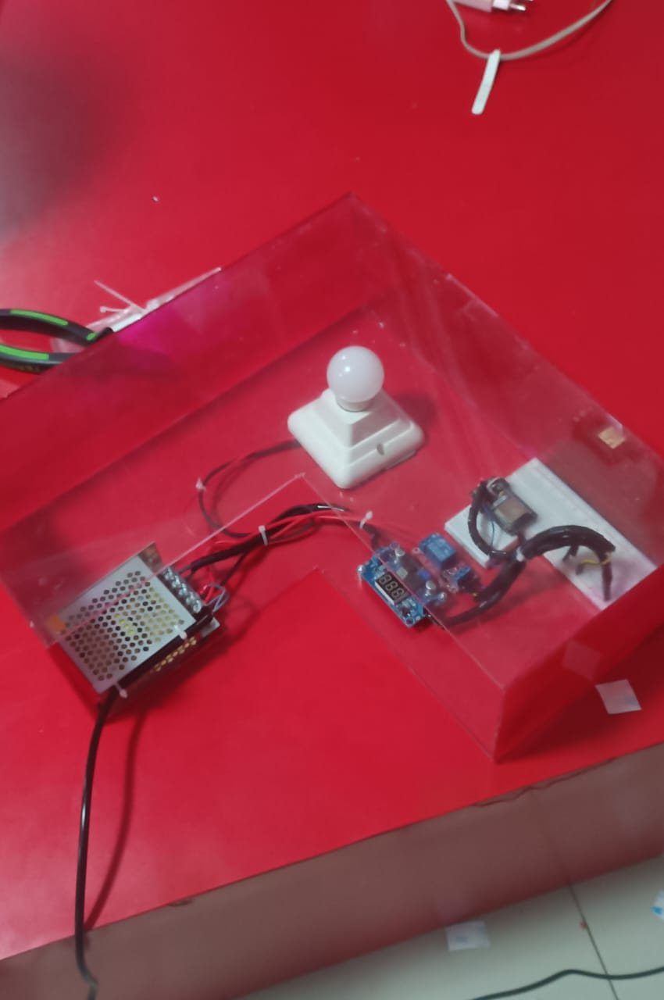
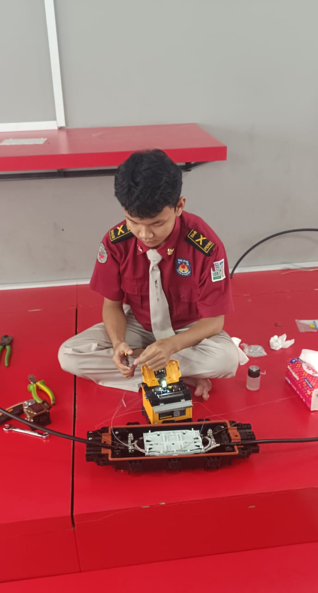
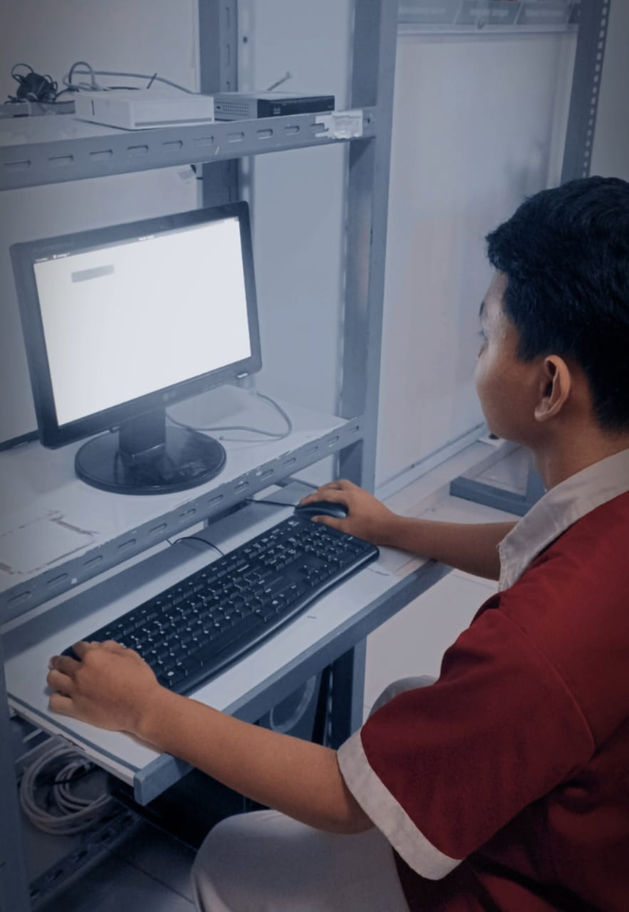
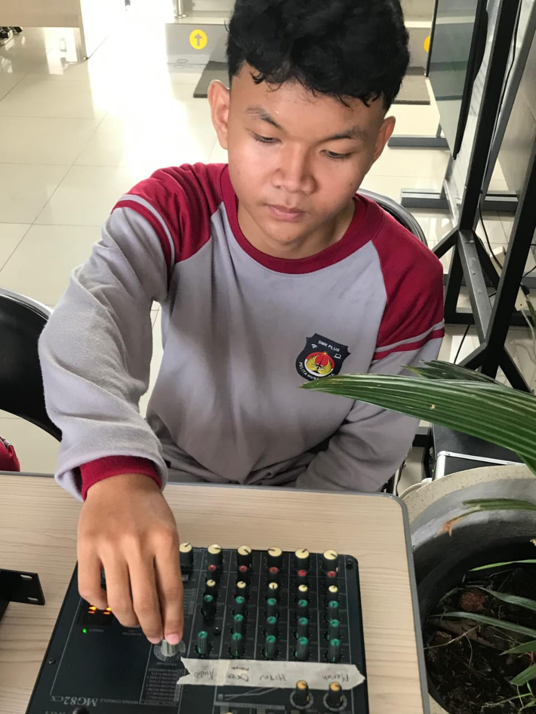
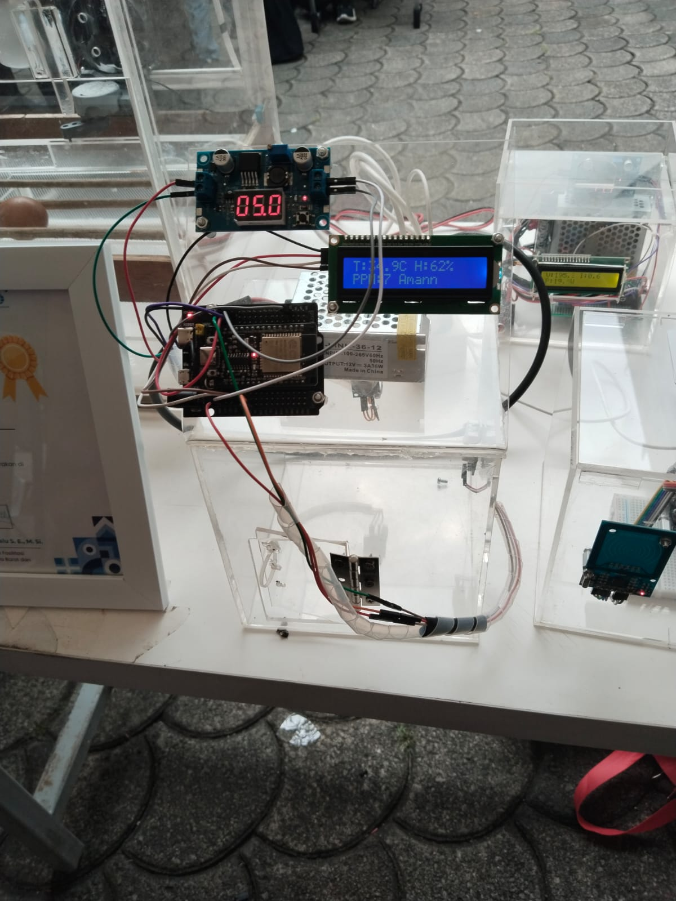
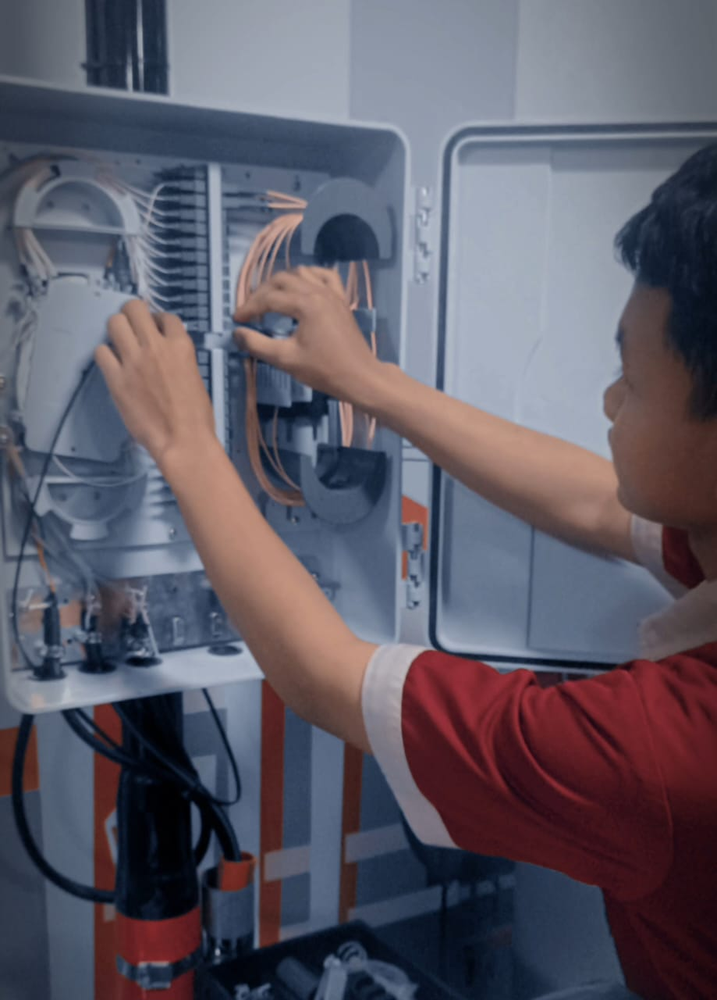
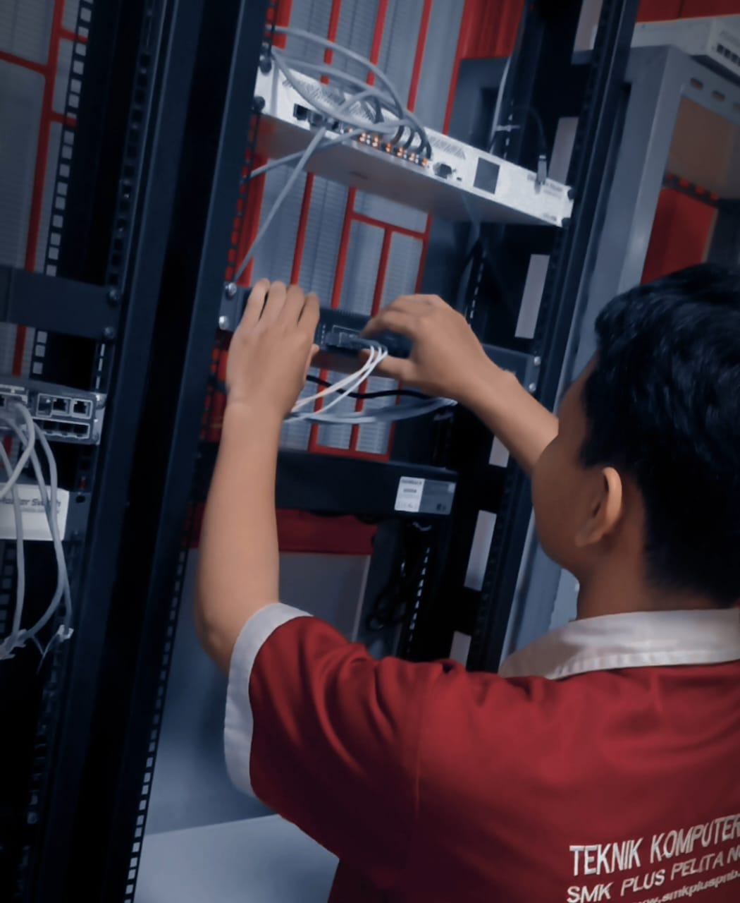
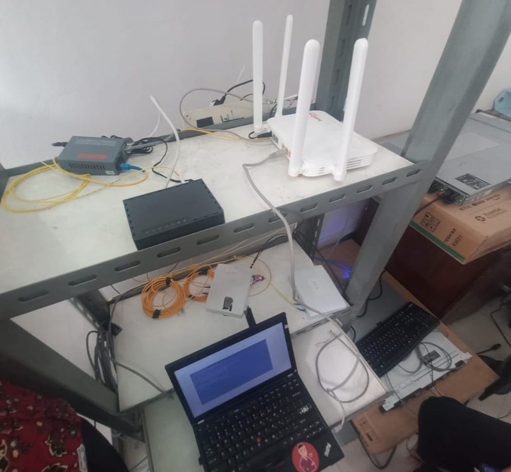
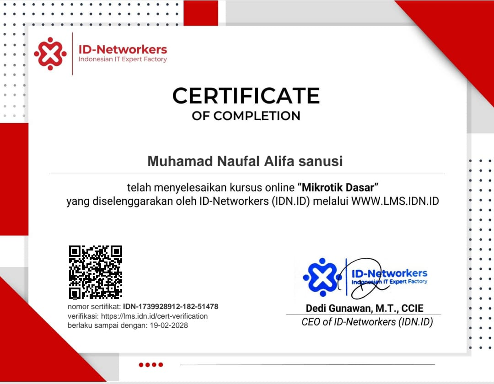
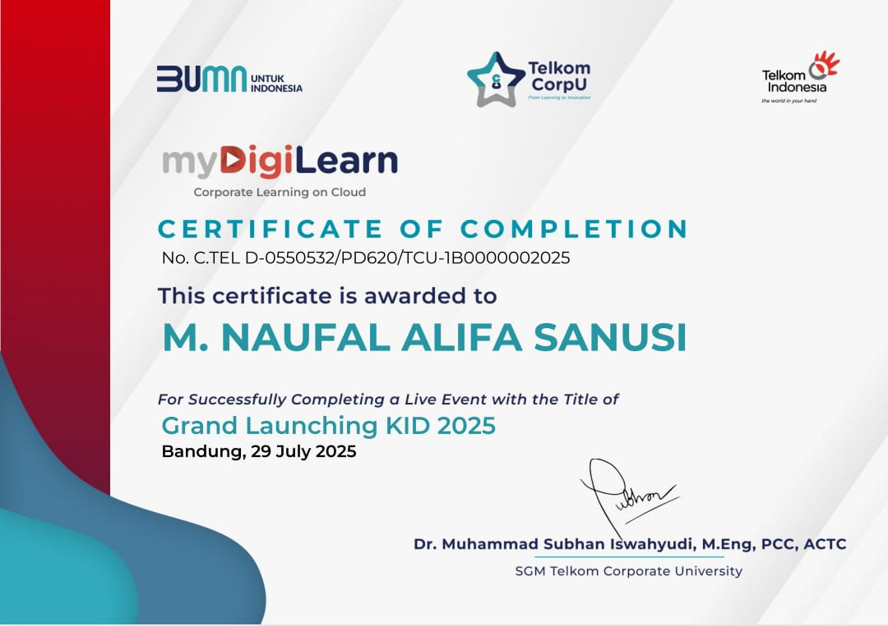

<!DOCTYPE html>
<html lang="en">
<head>
    <meta charset="UTF-8">
    <meta name="viewport" content="width=device-width, initial-scale=1.0">
    <title>My Portfolio - Muhamad Naufal Alifa Sanusi</title>
    <link href="https://fonts.googleapis.com/css2?family=Inter:wght@300;400;600;700&display=swap" rel="stylesheet">
    
</head>
<body>
    <header>
        <nav>
            <a href="#home">Home</a>
            <a href="#about">About Me</a>
            <a href="#skills">Skills</a>
            <a href="#projects">Projects</a>
            <a href="#contact">Contact</a>
        </nav>
    </header>

    <section id="home" class="section hero">
        <h1>Welcome to My Portfolio</h1>
        
Student of Pelita Nusantara Vocational High School

        

    <a href="#projects">Lihat Proyek</a>
   <a href="img/cv_naufal.pdf.pdf" class="btn">Unduh CV</a>

    </section>

    <section id="about" class="section about">
        <h2>About Me</h2>
        
I am a student of Pelita Nusantara High School specializing in Computer Network Engineering with foundational skills in installing, configuring, and maintaining computer networks. Passionate about technological advancement, I actively enhance my expertise through training, hands-on practice, and personal projects. I am responsible, quick to learn, and eager to contribute to both company and workplace.

    </section>

    <section id="skills" class="section skills">
        <h2>My Skills</h2>
        

            

                <h3>Mikrotik</h3>
                
Configuring VLAN and hotspot, blocking web, troubleshooting network issues

            

            

                <h3>Fiber Optic</h3>
                
Splicing and installation techniques for fiber optic networks

            

            

                <h3>Server</h3>
                
Operating system administration and server management

            

            

                <h3>Electrical</h3>
                
Basic electrical engineering and network infrastructure

            

        

    </section>

    <section id="projects" class="section projects">
        <h2>My Projects</h2>
        

            

                <h3>SMART LAMP AUTOMATICALLY</h3>
                
setup and splicing cable fiber and attenuation.

                
            

            

                <h3>SPLICING CABLE AND ANTENUATION</h3>
                
            

            

                <h3>NETWORK CONFIGURATION</h3>
                
            

            

                <h3>MONITORING SOUND SYSTEM</h3>
                
              
            

            

                <h3>MONITORING QUALITY </h3>
                
               
            

            

                <h3>INTALASI AND SPLITER CABLE FIBER OPTIK</h3>
                
               
            

            

                <h3>INTALASI AND CONFIGURATON PPOE</h3>
                
               
            

            

                <h3>TROUBLESHOOTING NETWORK</h3>
                
               
            

            

                <h3>SERTIFIKAT MIKROTIK DASAR</h3>
                
            

            

                <h3>SERTIFIKAT IMPLEMENTASI IPV6</h3>
                
            

            

                <h3>SERTIFIKAT WEBINAR TELKOM</h3>
                
            

        

    </section>

    <section id="contact" class="section contact">
    <h2>Contact Me</h2>
    <form action="https://formspree.io/f/mqadznbl" method="POST">
        <input type="text" name="name" placeholder="Nama Kamu" required>
        <input type="email" name="email" placeholder="Email Kamu" required>
        <textarea name="message" placeholder="Pesan Kamu" required></textarea>
        <!-- Wajib tambahkan input hidden untuk format JSON -->
        <input type="hidden" name="_replyto" value="">
        <input type="hidden" name="_subject" value="Pesan Baru dari Portfolio">
        <button type="submit" class="submit-btn">Kirim Pesan</button>
    </form>
</section>

    </section>

    <footer>
        
© 2025 Muhamad Naufal Alifa Sanusi Portfolio. All Rights Reserved.

    </footer>

    

        

            <h2>Add Photo</h2>
            <input type="file" id="photoInput" accept="image/*">
            

                <button onclick="uploadPhoto()">Upload</button>
                <button class="close-btn" onclick="closeModal()">Close</button>
            

        

    

    
</body>
</html>
